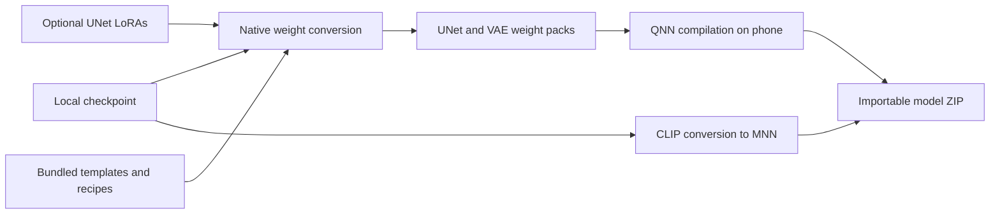

# npuforge

**Convert SD1.5 and SDXL checkpoints into Qualcomm QNN models entirely on an Android phone.**

[Technical overview](docs/TECHNICAL-OVERVIEW.md) · [Results](docs/RESULTS.md) · [Build](docs/BUILD.md) · [Tests](docs/TESTING.md) · [Limitations](docs/LIMITS.md)

npuforge turns a local `.safetensors` checkpoint into an importable model ZIP for
Snapdragon NPU image generation. The phone converts the weights, merges optional
UNet LoRAs, and compiles QNN context binaries. Each export includes the checkpoint's
own text encoder(s), embeddings, **VAE encoder and VAE decoder**.

**To our knowledge, npuforge is the first publicly documented Android app to
convert SDXL checkpoints into QNN models entirely on-device.** A review of
related projects on 16 September 2026 found host-side conversion and mobile
inference workflows, but no equivalent in-app SDXL conversion path.
[Related work and scope of this claim](docs/RELATED-WORK.md).

Once the APK and checkpoint are on the phone, conversion runs offline. The app
uses bundled graph templates and tokenizer data; new conversions do not download
CLIP or VAE weights. Template preparation and building the APK are developer tasks
performed separately on a workstation.

## What it enables

- **Local model conversion:** choose a checkpoint, convert it on the phone, and
  import the exported ZIP into a compatible image generator.
- **Checkpoint-owned components:** preserve a fine-tune's trained CLIP and VAE
  weights, including SDXL's two text encoders.
- **Baked-in LoRAs:** merge supported UNet adapters before quantization, with an
  independent strength for each adapter.
- **On-phone QNN compilation:** run the ARM64 QAIRT context generator inside the
  Android app, with storage-backed allocation for large SDXL compilation jobs.
- **Inspectable implementation:** Kotlin/Jetpack Compose app, native C/C++
  converters, Python reference tools, and host regression tests.

The app exports models. Image generation takes place in a compatible consumer,
which must support the exported graph interfaces and QNN runtime.

## How it works



A **template** stores a fixed graph and calibrated activation ranges. A **recipe**
maps checkpoint tensors into that graph, including layout changes and weight
quantization. Preparing these once per supported architecture allows subsequent
checkpoints to be converted without repeating workstation export and calibration.

The current UNet templates use INT8 weights and 16-bit activations (W8A16).
CLIP graphs use MNN; the UNet and both VAE graphs use QNN. VAE arithmetic on HTP
is FP16. Graph shapes, activation ranges and target configurations remain fixed;
compatibility and quality must be established for each model family.

[Architecture and engineering details](docs/TECHNICAL-OVERVIEW.md)

## Demonstrated results

| Result | Evidence and scope |
|---|---|
| **117 s SD1.5 conversion** | 24 s weight conversion + 93 s QNN compilation on Galaxy S25 Ultra; original UNet pipeline |
| **437 s SDXL conversion** | Reported total for the earlier O=3 pipeline on Galaxy S25 Ultra; predates checkpoint-owned CLIP/VAE conversion |
| **15 s SDXL image generation** | Export consumed by Aura: 1024 × 1024, 8 steps, CFG 1; generation time, not conversion time |
| **Pony restored by checkpoint-owned CLIPs** | Reported successful render after replacing only the text-encoder components |
| **Illustrious full-component conversion** | Successful reported output from `waiIllustriousSDXL_v170`; 1024 × 1024, 30 steps, CFG 7 |
| **LoRA conversion fixes confirmed** | Latest test APK reported working after DMD2 mapping, compiler allocation and workspace fixes |

These are individual measurements and tester reports. The 117 s and 437 s
figures are historical baselines, **not timings for today's full-component
pipeline**. [Results, methodology and remaining measurements](docs/RESULTS.md).

## Use the app

1. Install an APK built with the required runtime and generated assets.
2. Select a complete SD1.5 or SDXL `.safetensors` checkpoint.
3. Optionally add UNet LoRAs and set their strengths.
4. Start conversion and import `Download/npuforge/<name>.zip` into a compatible
   generator.

The current app targets Android 13+ on ARM64 Snapdragon devices. The Galaxy S25
Ultra with 12 GB RAM is the main demonstrated device. Available memory, storage,
firmware and compiler behavior matter; installed RAM alone does not establish
compatibility. Export **Save full troubleshooting log** when reporting a failure.

## Build and test

The supported Android build host is **Linux x86-64**, with JDK 21, Android SDK 37
and NDK 29.0.14206865. A working APK also needs externally supplied QAIRT runtime
files and generated graph assets. Those are not all present in a fresh clone.

```sh
# After provisioning the assets and SDK described in docs/BUILD.md:
./gradlew :app:assembleDebug :app:lintDebug
```

Host regression tests use synthetic tensors and need no phone, checkpoint or
Qualcomm SDK:

```sh
python3 -m venv .venv
. .venv/bin/activate
python -m pip install -r requirements-test.txt
python -m unittest discover -s tests -p 'test_*.py' -v
```

See [build instructions](docs/BUILD.md), [test coverage](docs/TESTING.md), and
[contributing](CONTRIBUTING.md).

## Current scope

- SD1.5 at 512 × 512 and SDXL at 1024 × 1024; complete LDM-layout F16/F32
  checkpoints. BF16 conversion is not implemented.
- Supported UNet LoRA layers include attention, ResNets and sampler convolutions.
  Unmatched tensors produce a warning; matched layers still merge. Text-encoder
  LoRAs and complete DoRA/LyCORIS semantics are not supported.
- Checkpoint-owned components address weight mismatches. They cannot guarantee
  that the fixed activation calibration suits every fine-tune.
- Full-component SD1.5 rendering, image-to-image and a broader device matrix
  still need documented evaluation.

[Complete compatibility notes](docs/LIMITS.md) · [Roadmap](ROADMAP.md)

## Repository guide

| Path | Purpose |
|---|---|
| [`app/`](app/) | Android UI, foreground conversion service and ZIP export |
| [`native/`](native/) | Weight converter, CLIP writer and compiler allocator |
| [`tools/`](tools/) | Python reference conversion and template authoring helpers |
| [`tests/`](tests/) | Native/Python regression and allocator tests |
| [`docs/`](docs/README.md) | Architecture, results, build instructions and research records |
| [`template/`](template/) | Original SD1.5 recipe and compact constants pack; separate provenance |

## License and provenance

Original application, converter and tooling source is under the [MIT License](LICENSE).
The checked-in template artifacts have separate non-commercial provenance.
Qualcomm SDK files, generated model libraries and checkpoints are not covered by
the source license and are not distributed here. See [NOTICE](NOTICE) for the
artifact boundaries and outstanding distribution questions.

An independent project by **Abraham Paul Jaison**. Qualcomm, Snapdragon and other
product names identify the technologies used; no affiliation or endorsement is
claimed.
