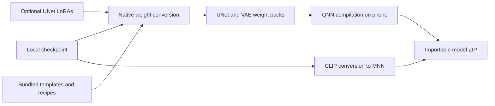

# npuforge

**Convert SD1.5 and SDXL checkpoints, including SD1.5 inpainting models, into Qualcomm QNN models entirely on an Android phone.**

[](https://github.com/AbrahamPaulJ/npuforge/actions/workflows/host-tests.yml)

[Technical overview](docs/TECHNICAL-OVERVIEW.md) · [Results](docs/RESULTS.md) · [Build](docs/BUILD.md) · [Tests](docs/TESTING.md) · [Limitations](docs/LIMITS.md)

npuforge turns a local `.safetensors` checkpoint into an importable model ZIP for
Snapdragon NPU image generation. The phone converts the weights, merges optional
UNet LoRAs, and compiles QNN context binaries. Each export includes the checkpoint's
own text encoder(s), embeddings, **VAE encoder and VAE decoder**.

**To our knowledge, npuforge is the first publicly documented Android app to
convert SDXL checkpoints into QNN models entirely on-device.** A review of
related projects on 16 September 2026 found host-side conversion and mobile
inference workflows, but no equivalent in-app SDXL conversion path.
[Related work and scope of this claim](docs/RELATED-WORK.md).

Once the APK and checkpoint are on the phone, SD1.5 conversion runs offline. The
app uses bundled graph templates and tokenizer data. Two files are downloaded once,
only when needed: SDXL conversions use precompiled SDXL VAE contexts (~192 MB), and
turning a plain SD1.5 checkpoint into an inpainting model uses the SD1.5 inpainting
difference (1.7 GB). Both can also be imported from a file. Template preparation and
building the APK are developer tasks performed separately on a workstation.

## What it enables

- **Local model conversion:** choose a checkpoint, convert it on the phone, and
  import the exported ZIP into Fancy-Ai or Nightmare Mobile.
- **Checkpoint-owned components:** preserve a fine-tune's trained CLIP and VAE
  weights, including SDXL's two text encoders.
- **Baked-in LoRAs:** merge supported UNet adapters before quantization, with an
  independent strength for each adapter.
- **On-phone QNN compilation:** run the ARM64 QAIRT context generator inside the
  Android app, with storage-backed allocation for large SDXL compilation jobs.
- **SD1.5 inpainting models:** 9-channel inpainting checkpoints (the
  "-inpainting" releases) are detected and converted automatically. Any plain
  SD1.5 checkpoint can also be converted *as* an inpainting model: the app adds
  the official SD1.5 inpainting difference to it on the phone.
- **SD1.5 Swap (experimental):** *Convert as → SD1.5 Swap* builds the UNet with
  LoRA (rank 64, 160 layers), ControlNet residuals and — since 1.0.7 —
  IP-Adapter image-prompt K/V as graph **inputs**, so
  [Nightmare Mobile](https://github.com/AbrahamPaulJ/nightmare-mobile) picks LoRAs,
  canny / depth / openpose ControlNets and a reference picture (IP-Adapter Plus or
  Plus-Face) per render, with no reconversion. About 15–20% slower per image than
  a plain conversion (the IP inputs add 3% when unused); the compile takes about
  twice as long. 512×512. Exports from 1.0.6 keep working without a reference
  picture. Details: [docs/SD15-LORA-CN-TEMPLATE.md](docs/SD15-LORA-CN-TEMPLATE.md).
- **SDXL Swap (1.0.11):** *Convert as → SDXL Swap* builds an SDXL checkpoint
  into the SDXL Swap template — calibrated on Illustrious-XL, NoobAI-XL
  v-pred and SDXL base, prompts up to 462 tokens, with **LoRA** as a graph input
  chosen per render (tick it, or leave it off for a plain SDXL export). LoRA
  slows every render by about 30% in our phone measurements. ControlNet,
  IP-Adapter and Inpaint are in the template but **not offered in this
  release**: SDXL Swap inpaint conversions render blotchy fills, and the other
  two are being verified on renders first. Exports need Nightmare Mobile's SDXL
  Swap support (1.6.096 or newer). Details: [docs/SDXL-SWAP-TEMPLATE.md](docs/SDXL-SWAP-TEMPLATE.md).
- **Clip skip 1 or 2:** choose how SD1.5 text encoders are built. 2 is the
  default and matches earlier exports; 1 uses the full text encoder.
- **V-prediction compatibility:** the app reads standard
  `modelspec.prediction_type` checkpoint metadata and lets the user override it.
  V-prediction exports include the `V_PRED` marker understood by compatible
  LocalDream-based runtimes, including Nightmare Mobile 1.6.075 and later.
- **Low-RAM phones:** below 10 GB of RAM, the SD1.5 compile keeps its working
  memory in a temporary file instead of RAM, so Android is far less likely to
  stop the conversion. It takes about twice as long.
- **Downloads that survive bad connections:** downloads resume where they
  stopped and fall back between Hugging Face and the hf-mirror.com mirror. The
  Utility tab's *Download source* picks which to try first; phones set to
  China's timezone start with the mirror.
- **Inspectable implementation:** Kotlin/Jetpack Compose app, native C/C++
  converters, Python reference tools, and host regression tests.

## Supported generation apps

Output models work only with:

- [Fancy-Ai](https://github.com/Mr-J-369/Fancy-Ai)
- [Nightmare Mobile](https://github.com/AbrahamPaulJ/nightmare-mobile)

Import the exported ZIP through either app's custom-model workflow. SD1.5
exports, including inpainting models, need Nightmare Mobile **1.6.033 or later**.
Inpainting in Fancy-Ai is untested. Device and QNN runtime compatibility still
apply.

## How it works


```mermaid
flowchart LR
    A[Local checkpoint] --> B[Native weight conversion]
    L[Optional UNet LoRAs] --> B
    T[Bundled templates and recipes] --> B
    B --> C[UNet and VAE weight packs]
    C --> D[QNN compilation on phone]
    A --> E[CLIP conversion to MNN]
    D --> F[Importable model ZIP]
    E --> F
```

A **template** stores a fixed graph and calibrated activation ranges. A **recipe**
maps checkpoint tensors into that graph, including layout changes and weight
quantization. Preparing these once per supported architecture allows subsequent
checkpoints to be converted without repeating workstation export and calibration.

The current UNet templates use INT8 weights and 16-bit activations (W8A16).
CLIP graphs use MNN; the UNet and both VAE graphs use QNN. VAE arithmetic on HTP
is FP16. Graph shapes and activation ranges remain fixed, and each phone compiles
for its own chip;
compatibility and quality must be established for each model family.

[Architecture and engineering details](docs/TECHNICAL-OVERVIEW.md)

## Demonstrated results

| Result                                      | Evidence and scope                                                                                             |
|---------------------------------------------|----------------------------------------------------------------------------------------------------------------|
| **117 s SD1.5 conversion**                  | 24 s weight conversion + 93 s QNN compilation on Galaxy S25 Ultra; original UNet pipeline                      |
| **437 s SDXL conversion**                   | Reported total for the earlier O=3 pipeline on Galaxy S25 Ultra; predates checkpoint-owned CLIP/VAE conversion |
| **15 s SDXL image generation**              | Generated from the exported model: 1024 × 1024, 8 steps, CFG 1; generation time, not conversion time           |
| **Pony restored by checkpoint-owned CLIPs** | Reported successful render after replacing only the text-encoder components                                    |
| **Illustrious full-component conversion**   | Successful reported output from `waiIllustriousSDXL_v170`; 1024 × 1024, 30 steps, CFG 7                        |
| **LoRA conversion fixes confirmed**         | Latest test APK reported working after DMD2 mapping, compiler allocation and workspace fixes                   |
| **SD1.5 inpainting on the phone**           | DreamShaper 8 inpainting, DreamShaper 8 base and CuteYukiMix converted in the app and inpainted in Nightmare Mobile; phone and PC builds render byte-identical images |
| **Low-RAM compile**                         | Compiler RAM 2.89 GB → 0.03 GB on Galaxy S25 Ultra with an identical output; not yet run on an 8 GB phone     |

These are individual measurements and tester reports. The 117 s and 437 s
figures are historical baselines, **not timings for today's full-component
pipeline**. [Results, methodology and remaining measurements](docs/RESULTS.md).

## Use the app

1. Install an APK built with the required runtime and generated assets.
2. Select a complete SD1.5 or SDXL `.safetensors` checkpoint, through the system
   picker or a file manager such as MiXplorer.
3. Confirm the prediction type. Checkpoint metadata selects it when available;
   epsilon remains the fallback for older files.
4. For SD1.5, choose *Text-to-image* or *Inpainting* and a clip skip.
5. Optionally add UNet LoRAs and set their strengths.
6. Start conversion and import `Download/npuforge/<name>.zip` into **Fancy-Ai**
   or **Nightmare Mobile**.

The current app targets Android 13+ on ARM64 Snapdragon devices: Snapdragon 8
Gen 1 or newer for SD1.5, 8 Gen 3 or newer for SDXL. Snapdragon 888 and older are
not supported. **Convert on the phone you will generate on:** the compiler builds
for the chip it runs on, so an export from a newer chip will not load on an older
one. The Galaxy S25 Ultra with 12 GB RAM is the main demonstrated device. Available memory, storage,
firmware and compiler behavior matter; installed RAM alone does not establish
compatibility. Export **Save full troubleshooting log** when reporting a failure.

## Build and test

The Android build runs on **Linux x86-64** or Windows, with JDK 21, Android SDK
37 and NDK 30.0.16248370. A working APK also needs externally supplied QAIRT runtime
files and generated graph assets. Those are not all present in a fresh clone.

```sh
# After provisioning the assets and SDK described in docs/BUILD.md:
./gradlew :app:assembleDebug :app:lintDebug
```

Host regression tests use synthetic tensors and need no phone, checkpoint or
Qualcomm SDK:

```sh
python3 -m venv .venv
. .venv/bin/activate
python -m pip install -r requirements-test.txt
python -m unittest discover -s tests -p 'test_*.py' -v
```

See [build instructions](docs/BUILD.md), [test coverage](docs/TESTING.md), and
[contributing](CONTRIBUTING.md).

## Current scope

- SD1.5 at 512 × 512 (text-to-image and 9-channel inpainting) and SDXL at
  1024 × 1024; complete LDM-layout F16/F32/BF16 checkpoints, including mixed
  weight dtypes. BF16 input is expanded to FP32;
  compiled graph precision is unchanged.
- Supported UNet LoRA layers include attention, ResNets and sampler convolutions.
  Unmatched tensors produce a warning; matched layers still merge. Text-encoder
  LoRAs and complete DoRA/LyCORIS semantics are not supported.
- Checkpoint-owned components address weight mismatches. They cannot guarantee
  that the fixed activation calibration suits every fine-tune.
- SDXL inpainting models and other resolutions need new templates; see the
  [roadmap](ROADMAP.md). SDXL image-to-image and a broader device matrix still
  need documented evaluation.

### Known issues

- **Snapdragon 8s Gen 4 (SM8735) cannot convert SD1.5.** Its NPU has no fp16
  support. The SD1.5 VAE graphs compute in fp16, so conversion stops at the VAE
  encoder; the app reports this instead of a raw compiler error. The UNet is
  likely affected too: models compiled with QAIRT 2.49 and newer have been
  rejected on this chip, while QAIRT 2.28 builds run. A fix needs integer
  (quantized) VAE graphs and a QAIRT 2.28 compile path; it is planned, not
  scheduled ([roadmap](ROADMAP.md)).

[Complete compatibility notes](docs/LIMITS.md) · [Roadmap](ROADMAP.md)

## Repository guide

| Path                      | Purpose                                                               |
|---------------------------|-----------------------------------------------------------------------|
| [`app/`](app/)            | Android UI, foreground conversion service and ZIP export              |
| [`native/`](native/)      | Weight converter, CLIP writer and compiler allocator                  |
| [`tools/`](tools/)        | Python reference conversion and template authoring helpers            |
| [`tests/`](tests/)        | Native/Python regression and allocator tests                          |
| [`docs/`](docs/README.md) | Architecture, results, build instructions and research records        |
| [`template/`](template/)  | Original SD1.5 recipe and compact constants pack; separate provenance |

## License and provenance

Original application, converter and tooling source is under the [MIT License](LICENSE).
The checked-in template artifacts have separate non-commercial provenance.
Qualcomm SDK files, generated model libraries and checkpoints are not covered by
the source license and are not distributed here. See [NOTICE](NOTICE) for the
artifact boundaries and outstanding distribution questions.

### Credits

- **SD1.5 inpainting difference** (downloaded on demand): computed from RunwayML's
  `sd-v1-5-inpainting` and `v1-5-pruned-emaonly`, CreativeML OpenRAIL-M.
- **SD1.5 inpainting template**: calibrated on Lykon's DreamShaper 8 Inpainting
  (CreativeML OpenRAIL-M), exported with Local Dream's modified diffusers UNet
  (xororz, CC BY-NC 4.0).
- **SDXL VAE contexts** (downloaded on demand): precompiled and hosted by Mr.J in
  [`Mr-J-369/Fancy-AI`](https://huggingface.co/Mr-J-369/Fancy-AI); see that
  repository for terms.
- **hf-mirror.com**: an independent Hugging Face mirror, used as a download source.
- **Qualcomm QAIRT** runtime and compiler; **MNN** (Alibaba, Apache-2.0) text-encoder format.

An independent project by **Abraham Paul Jaison**. Qualcomm, Snapdragon and other
product names identify the technologies used; no affiliation or endorsement is
claimed.
